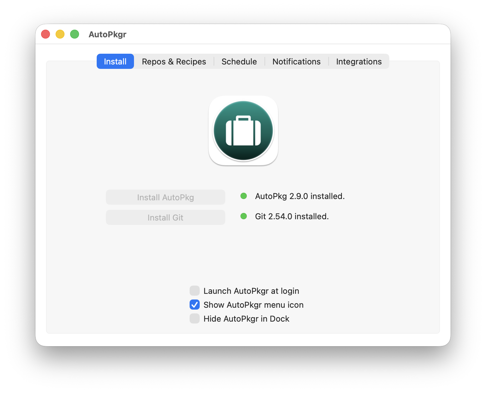

AutoPkg is widely used by Mac Admins to automate the packaging of all kinds of
apps, and to make them available for users to install or patch. I started using
it five years ago.

It began with a Mac mini sitting in a cold and lonely server room, running
AutoPkgr, which was the only GUI for interacting with the binary. It was
scheduled to run every night, and it took some time before packages became
available in Jamf.

*AutoPkgr. The Schedule tab is what ran the whole thing overnight.*

I used community recipes in the hope of borrowing someone else's effort and
avoiding writing my own. I soon found that unavoidable. Those were the days
without AI, but luckily there were plenty of examples to learn from. To name
just a few: [rtrouton](https://github.com/autopkg/rtrouton-recipes),
[smithjw](https://github.com/autopkg/smithjw-recipes),
[homebysix](https://github.com/autopkg/homebysix-recipes),
[grahampugh](https://github.com/autopkg/grahampugh-recipes), and it goes on.
Writing
recipes is a bit steep at the beginning, but it soon turns into a joyful
experience, like picking the right block of Lego, the processor, to build a
package and extract the version. Not to mention using Charles Proxy to reverse
engineer the source URL of an app.

The [AutoPkg processor reference](https://github.com/autopkg/autopkg/wiki/Processors-and-Variables)
is a page I still visit frequently.

Soon after, we moved off the dedicated Mac mini to a hosted Mac platform,
MacStadium. It did not really matter whether it had to build hundreds of apps,
because the hosted service was already paid for at a flat rate. That Mac mini
had served me very well.

## Ephemeral runners

After a short break from work, where I could catch up on new tech that might
improve AutoPkg, I was working closely with DevOps, which gave me knowledge of
GitOps and infrastructure as code. It turns out it is technically possible to run
AutoPkg on an ephemeral macOS runner in GitHub. That not only costs far less, it
also completely removes the maintenance work of any standing Mac instance.

Porting the local workflow was not as difficult as I had thought. What it really
needs is the environment variables AutoPkg requires, and running AutoPkg purely
from the command line, without AutoPkgr. Deploying AutoPkg in GitHub through a
workflow means:

1. install AutoPkg
2. configure AutoPkg, including the overrides, the cache and the other working
   directories, and add all the parent recipes required
3. run AutoPkg
4. upload the package to an MDM such as Jamf

The coding was not a huge effort, with a little help from Claude. There is,
however, a discrepancy between the published storage of a macOS runner and the
real one. At the time of writing it is 320GB rather than the published 14GB,
which is a relief: I do not have to worry too much about running out of space
after packaging titles like IntelliJ IDEA, which run to gigabytes.

## cloud-autopkg-runner

One of the caveats of AutoPkg is that it runs recipes sequentially. That means
packaging takes a long time as the recipe list grows longer.
[cloud-autopkg-runner](https://github.com/MScottBlake/cloud-autopkg-runner) lets
you run recipes concurrently. Having benchmarked the GitHub macOS runner with
various `CONCURRENCY` values, 4 seems to be the best I can get.

Another big advantage is caching, which I will cover in the next post.
